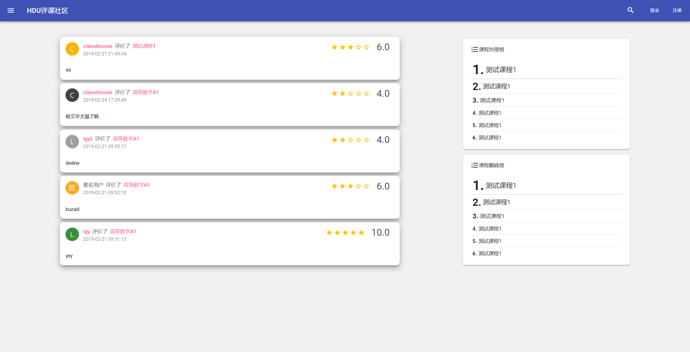
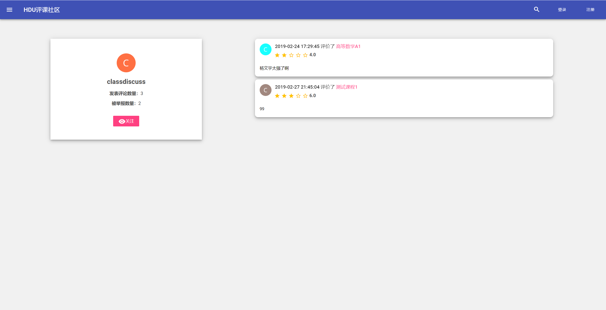
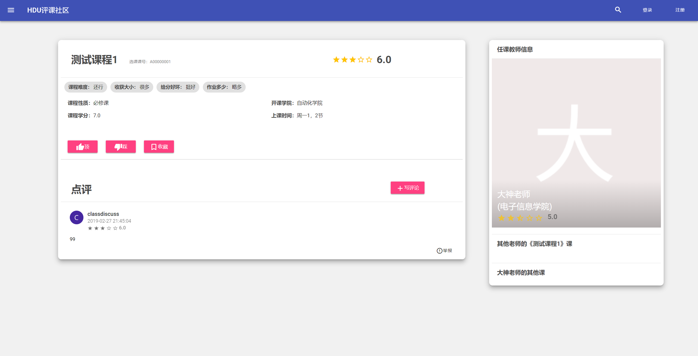
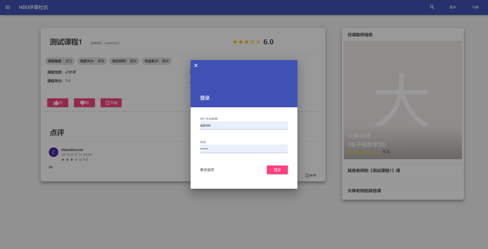
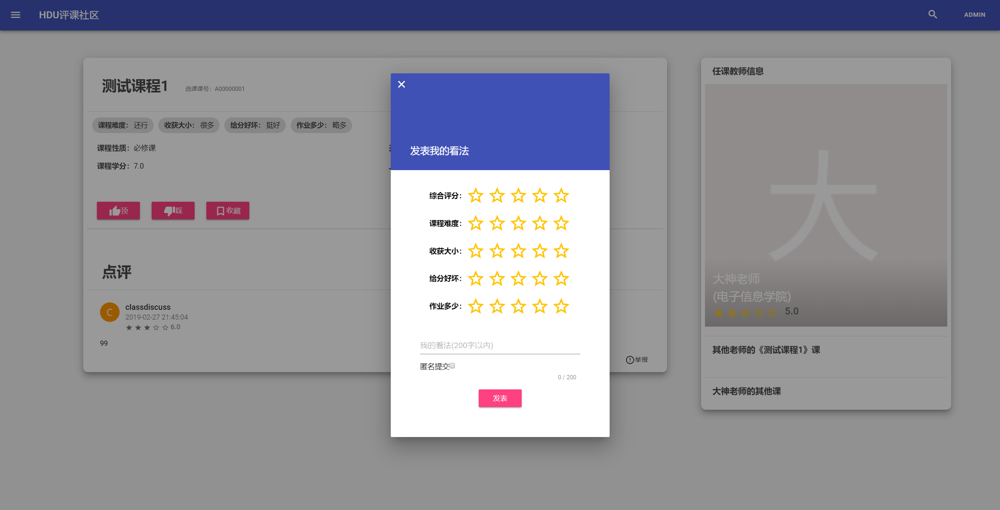
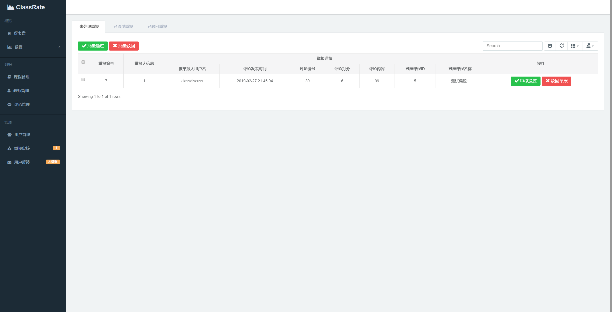
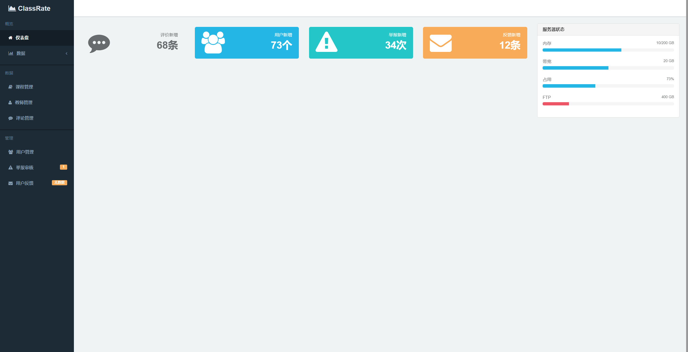
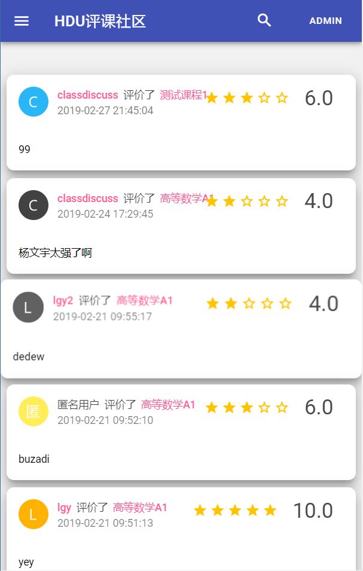
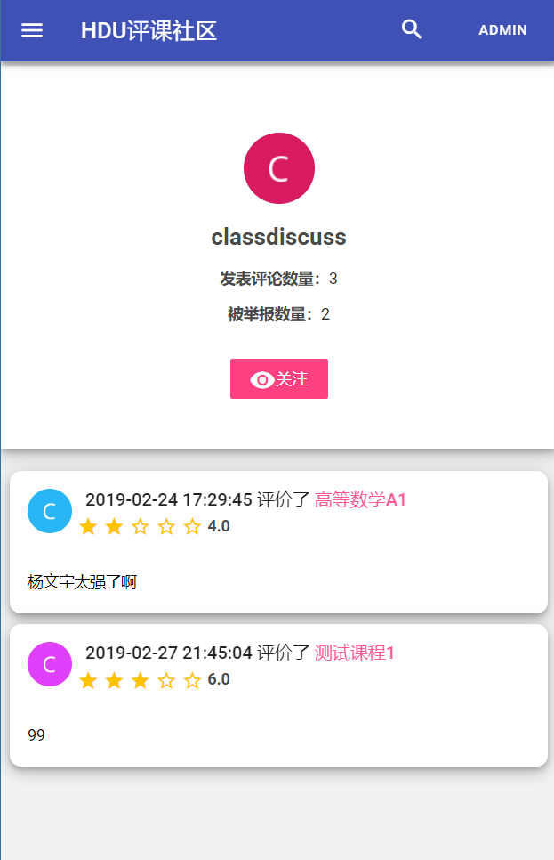
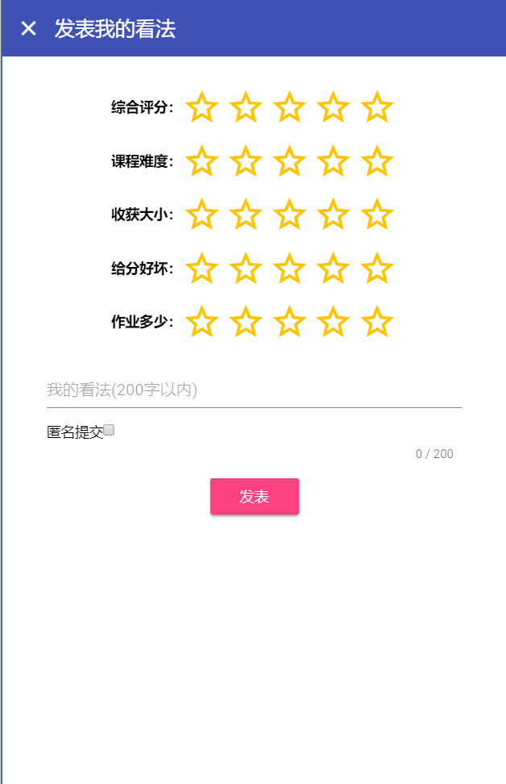

# 评课社区
` 高校评课系统 `
` 评课社区 `
--------
## 简介

一款采用Google Material Design的**响应式评课社区**，创立初衷在于帮助同学们更好的选课，目前还在继续完善中，考虑到恶意评价的问题，将会在完成后考虑投入使用，*欢迎有共同兴趣的人一起加入我们*！

### 项目进展
> - [x] Index最近评价页面
> - [x] 课程详情页面
> - [x] 用户详情页面 
> - [x] 登陆、注册机制 
> - [x] 相似课程、相似老师匹配
> - [x] 举报、我喜欢、顶、踩机制
> - [x] 正方教务系统爬取
> - [x] 基础后台（举报审核、课程管理）
> - [ ] 数据库优化
> - [ ] 防刷分、恶意评价系统
> - [ ] 教师详情页面
> - [ ] 用户个人设置页面
> - [ ] 课程搜索（ing...）
> - [ ] 教务系统接入
> - [ ] 课程得分计算算法（目前是直接平均）
> - [ ] 。。。

## 一些截图

